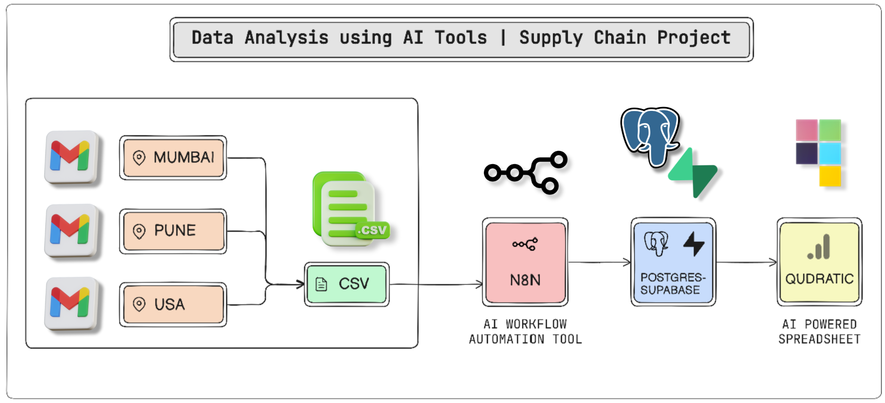
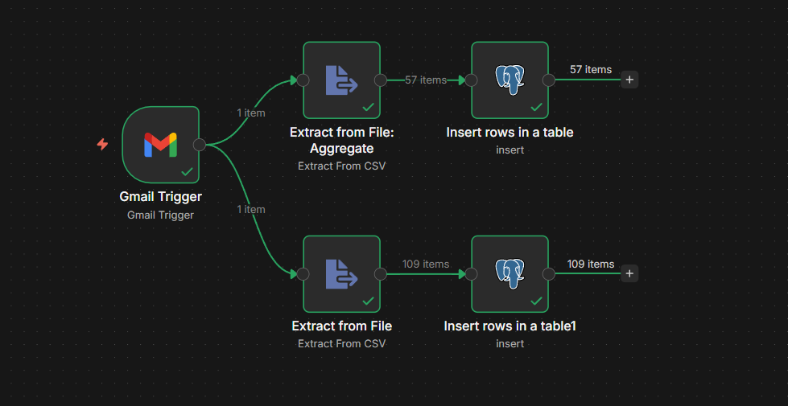
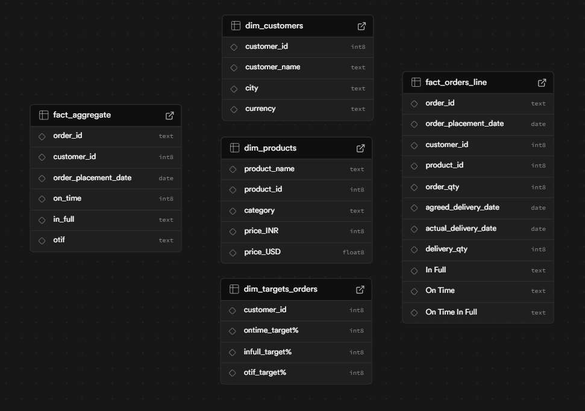
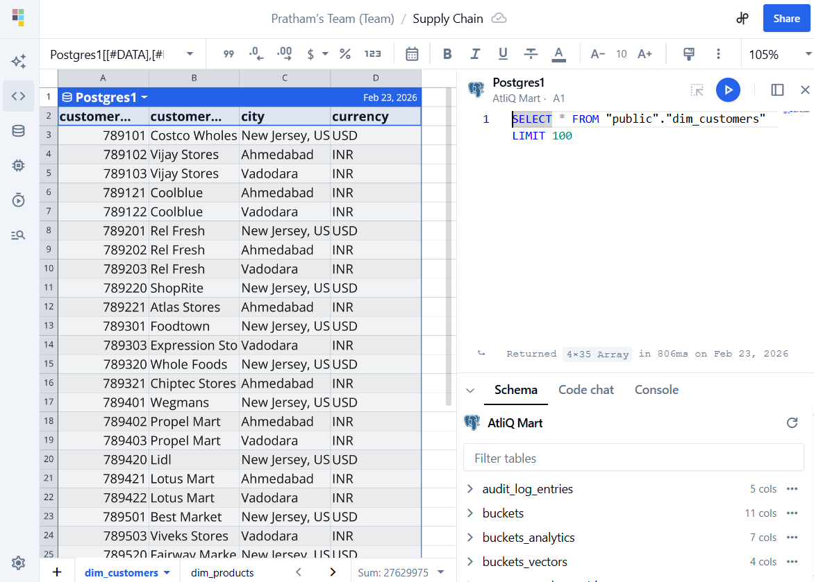

<h1 align="center">End-to-End AI-Powered Supply Chain Analytics</h1>
<h2 align="center">Atliq Mart Domain Analytics Dashboard</h2>

---

## 📌 Project Overview

This project simulates an advanced Business Intelligence solution for **Atliq Mart**, an organic food manufacturer.

The objective was to solve critical supply chain reliability issues—such as inconsistent inventory and customer dissatisfaction—by automating the data pipeline from unstructured emails to a cloud database and building an AI-assisted analysis environment.

The entire workflow was implemented using an "AI-First" mindset, leveraging **n8n** for agentic automation, **Supabase** for data warehousing, and **Quadratic** for AI-driven insights.

---

## 📈 Dashboard Preview

### System Architecture

### Mail Fetching 

### Automation Workflow (n8n)
 

### Database Schema (Supabase)

### Qudractic AI SpreadSheet
 

---

## 🎯 Business Problem

Atliq Mart required clear visibility into their supply chain reliability due to:

- **Customer Dissatisfaction**: Significant issues in order management and delivery performance.
- **Inventory Management**: Failure to maintain optimum inventory levels across regions.
- **Technical Gap**: Lack of automated tracking for "harsh" reliability metrics like OTIF (On-Time In-Full).
- **Manual Overhead**: Inefficient processes for handling data from multiple cities (India & USA).

---

## 📊 Dataset

- **Format**: CSV (Extracted via Gmail automation from daily sales emails).
- **Type**: Structured supply chain transactional and master data.
- **Tables**: 
  - `fact_orders_line`: Detailed order item data including agreed vs. actual delivery dates.
  - `fact_aggregate`: Consolidated order-level data.
  - `dim_customers` & `dim_products`: Master data for regional and product analysis.
  - `dim_targets_orders`: Performance targets for fulfillment metrics.

Dataset available in the `/dataset` folder.

---

## ⚙️ Tools & Technologies Used

- **n8n**: Agentic workflow automation used to monitor Gmail and ingest data into the cloud.
- **Supabase (PostgreSQL)**: Cloud-hosted relational database used for data modeling and storage.
- **Quadratic**: AI-powered spreadsheet interface for Python-based analysis and visualization.
- **Python (Pandas)**: Applied within Quadratic for data cleaning, currency conversion, and KPI generation.
- **OpenExchange API**: Integration used to fetch real-time USD/INR exchange rates.

---

## 🧱 Workflow Architecture

**Email Ingestion** → **n8n Automation** (Monitors Gmail, extracts CSVs, and standardizes ISO date formats)  
→ **Supabase** (Stores data in a Relational Star Schema)  
→ **Quadratic AI** (Uses Python to merge tables and calculate supply chain KPIs)  
→ **Business Insights** (Root cause analysis and regional performance tracking).

---

## 📂 Project Structure

- **Dataset** → `/dataset` (Raw CSV files used for ingestion)
- **Database Schema** → `/sql` (PostgreSQL `CREATE` scripts for all tables)
- **Workflows** → `/n8n` (JSON export of the agentic pipeline)
- **Screenshots** → `/images` (System architecture and dashboard views)
- **Analysis Logic** → `/scripts` (Python prompts and snippets used for data transformation)

---

## ▶ How to Replicate the Project

1. **Database**: Run the SQL scripts in the `/sql` folder on your **Supabase** SQL editor to build the Star Schema.
2. **Automation**: Import the `.json` file from `/n8n` into your **n8n** instance and configure your Gmail and Supabase credentials.
3. **Analysis**: Open **Quadratic**, connect your database, and execute the Python cells provided in the `/scripts` folder to generate the `fact_summary`.

---

## 💡 Key Outcomes

- **Automated Pipeline**: Implemented a hands-free data flow from inbox to database.
- **Reliability Metrics**: Successfully calculated OTIF (On-Time In-Full), Line Fill Rate, and Volume Fill Rate.
- **AI Integration**: Leveraged AI agents to automate complex data cleaning and Python coding.
- **Actionable Insights**: Identified performance gaps between Indian and US markets to support C-suite decision-making.

---

## 🔗 Important Links  

- 🎥 **YouTube Walkthrough (Project Demo & Explanation)** [Watch the full project walkthrough by Codebasics](https://youtu.be/PglKAYgRCbAu32GaW)

---